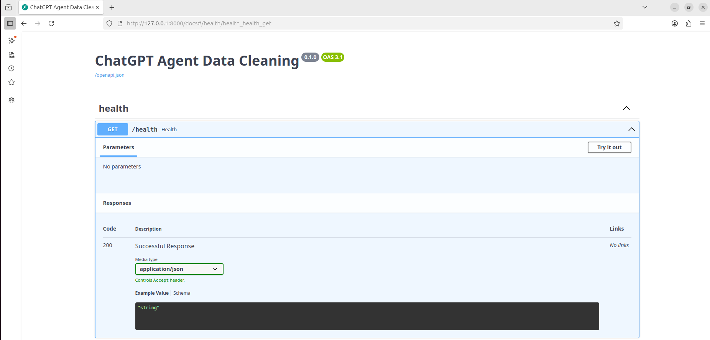
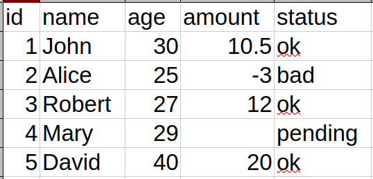

# ChatGPT Agent Data Cleaning

Agent that ingests CSVs, runs **deterministic data-quality checks**, then overlays an **LLM review** to propose rules and safe fixes. Exposes a FastAPI service with `/validate` and `/health`.

## Features
- Deterministic validators (schema, nulls, ranges, enums, uniqueness, regex)
- LLM suggestions for rule refinement + fix proposals (never auto-applies)
- JSON reports with row/column-level findings
- Fast, streaming-friendly endpoint

## Quick Start
```bash
python -m venv .venv && source .venv/bin/activate
pip install -r requirements.txt
uvicorn app:app --host 0.0.0.0 --port 8000
API
Health
curl -s http://localhost:8000/health
Validate
curl -s -X POST http://localhost:8000/validate \
  -H "Content-Type: application/json" \
  -d '{
        "csv_base64": "<BASE64_CSV>",
        "schema": {"columns":[{"name":"id","type":"int","required":true}]},
        "rules": [{"type":"unique","columns":["id"]}],
        "enable_llm_review": true
      }'
Response (abridged)
{
  "summary": {"rows": 1234, "errors": 7, "warnings": 3},
  "deterministic_findings": [
    {"level":"error","row":42,"column":"id","code":"DUPLICATE","detail":"id=101"}
  ],
  "llm_suggestions": [
    {"rule":"trim(name)","rationale":"leading spaces common in 5% rows"}
  ],
  "proposed_fixes": [
    {"row":42,"column":"name","action":"trim","preview_before":"  Alice","preview_after":"Alice"}
  ]
}
app.py                # FastAPI app (/validate, /health)
core/validators.py    # deterministic checks
core/llm.py           # suggestion/fix proposal wrapper
core/report.py        # JSON report shaping
tests/                # unit tests and fixtures
License

MIT (see LICENSE)
## Screenshots

| API Docs | Example CSV | Validate Endpoint |
|---|---|---|
|  |  |  |


## API
- **POST** `/validate` — multipart file=CSV, `?apply=true` to write cleaned file  
- **GET** `/health` — service heartbeat
## Folders
- app/services: ingest, profiling, rules, llm_agent, fixes  
- app/routers: validate, health  
- app/utils: pii, sampling, io  
- examples/: sample CSV + report
