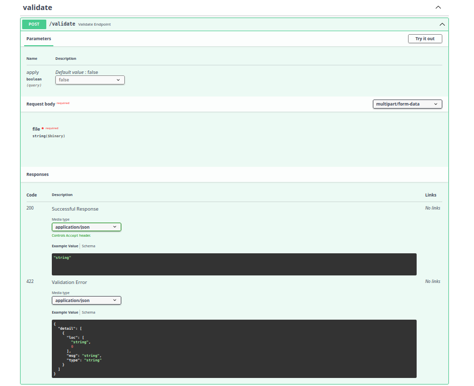

# ChatGPT Agent Data Cleaning

Agent that ingests CSVs, runs **deterministic data-quality checks**, then overlays an **LLM review** to propose rules and safe fixes.  
Exposes a FastAPI service with `/validate` and `/health` endpoints.

---

## Features
- Deterministic validators (schema, nulls, ranges, enums, uniqueness, regex)
- LLM suggestions for rule refinement + fix proposals (never auto-applies)
- JSON reports with row/column-level findings
- Fast, streaming-friendly endpoint

---

## Quick Start

### 1️⃣ Environment setup
```bash
python -m venv .venv
source .venv/bin/activate
pip install -r requirements.txt

2️⃣ Run the API
uvicorn app.main:app --host 0.0.0.0 --port 8000

3️⃣ Test the endpoints

Health check
curl -s http://localhost:8000/health

Validate a CSV
curl -s -X POST http://localhost:8000/validate \
  -H "Content-Type: application/json" \
  -d '{
    "csv_base64": "<BASE64_CSV>",
    "schema": {"columns": [{"name": "id", "type": "int", "required": true}]},
    "rules": [{"type": "unique", "columns": ["id"]}],
    "enable_llm_review": true
  }'

Example Response (abridged)
{
  "summary": {"rows": 1234, "errors": 7, "warnings": 3},
  "deterministic_findings": [
    {"level": "error", "row": 42, "column": "id", "code": "DUPLICATE"}
  ],
  "llm_suggestions": [
    {"rule": "trim(name)", "rationale": "leading spaces common in 5% rows"}
  ]
}

📂 Project Layout
app.py                  # FastAPI app (/validate, /health)
core/validators.py      # deterministic checks
core/llm.py             # suggestion/fix proposal wrapper
core/report.py          # JSON report shaping
tests/                  # unit tests and fixtures

## Screenshots

### FastAPI Docs UI


### Example CSV


### Validate Endpoint


## API
- **POST** `/validate` → multipart file upload; optional `apply=true` query writes cleaned CSV.
- **GET** `/health` → service heartbeat (200 OK)

## Folders
- `app/services/` → core ingestion, profiling, and LLM modules
- `app/routers/` → FastAPI route handlers

License

MIT (see LICENSE)
